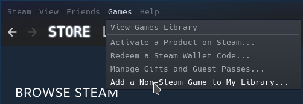
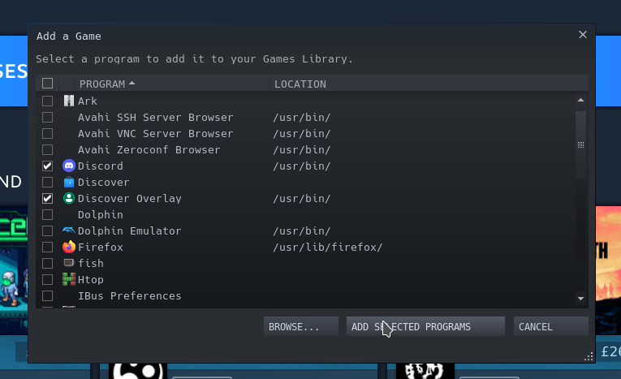
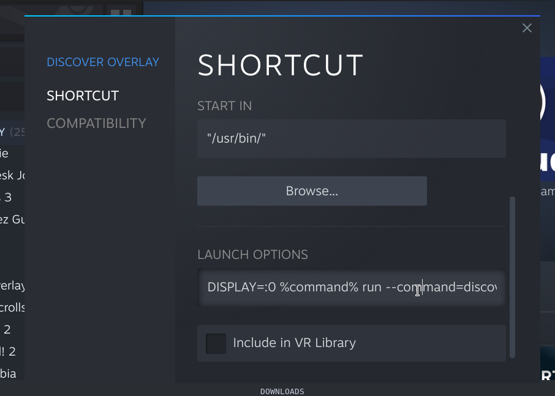

# Adding Discover Overlay and Discord as Non Steam Games on Steam Deck

- If you're not in desktop mode, [Switch to Desktop Mode](deckswitchdesktop)
- If they're not yet installed [Install Overlay and Discord](install_flathub)
- Click on the `Steam` icon on the desktop
- Select `Games` and then `Add a Non-Steam Game to My Library`

- Tick `Discord` and `Discover Overlay`
- Press `Add Selected Programs`

- Go to `Library`
- Right click (or left trigger if you're not using a mouse) with your cursor over `Discover Overlay` in the Library
- Choose `Properties`
- in `Launch Options` put 
```
DISPLAY=:0 %command% run io.github.trigg.discover_overlay
```
- optionally add ` --debug` if you wish to save debug messages to a file

- [Return to game mode](deckswitchgame)
- [Run Discover overlay & Deck on Game Mode](deckusage)
