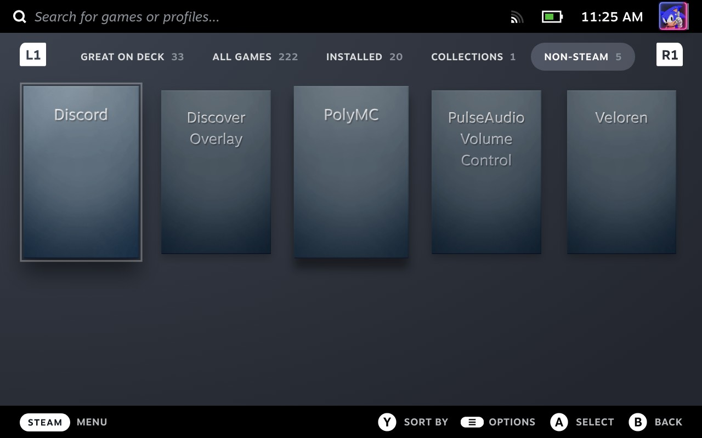
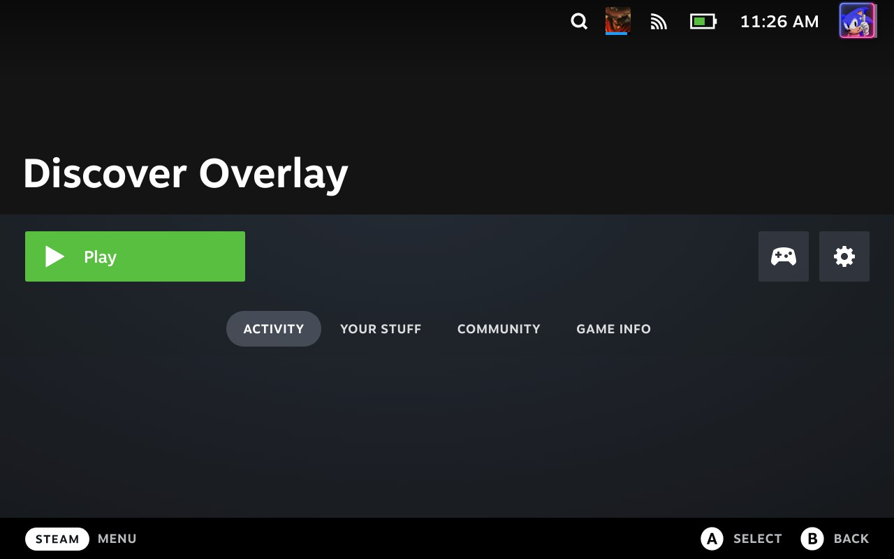

# Using Discover Overlay on Steam Deck

- Press `Steam`
- Choose `Library`
- Choose `Non-steam`

- Choose `Discover Overlay`
- Choose `Play`

- Press `Steam`
- Choose `Library`
- Choose `Discord`
- Choose `Play`
- Join voice room

Finally, to start a game directly after:
- Press `Steam`
- Navigate through `Home` or `Library` to start any game available

At any time the user may switch to either Discord or Discover Overlay to change settings, mute, change room etc.
