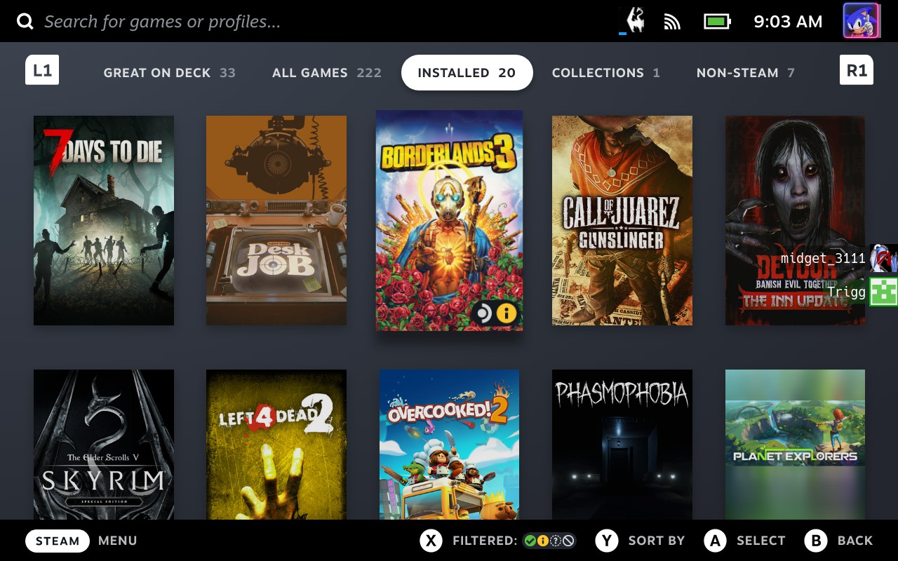

# Discover
Yet another Discord overlay for Linux written in Python using GTK3.

Discover-Overlay is a GTK3 overlay written in Python3. It can be configured to show who is currently talking on discord or it can be set to display text and images from a preconfigured channel. It is fully customisable and can be configured to display anywhere on the screen. We fully support X11 and wlroots based environments. We felt the need to make this project due to the shortcomings in support on Linux by the official discord client.

Considerably lighter on system resources and less hack-and-slash included than discord-overlay.

Try it on [Desktop](usage) or [Steam Deck](deckaddnonsteamgame) today!

Got a question about development or a feature request? [Join our Discord!](https://discord.gg/jRKWMuDy5V) or open an [issue on GitHub](https://github.com/trigg/Discover/issues)

Thank you to Liam from GamingOnLinux for showcasing our overlay and demonstrating how easy it is to install.